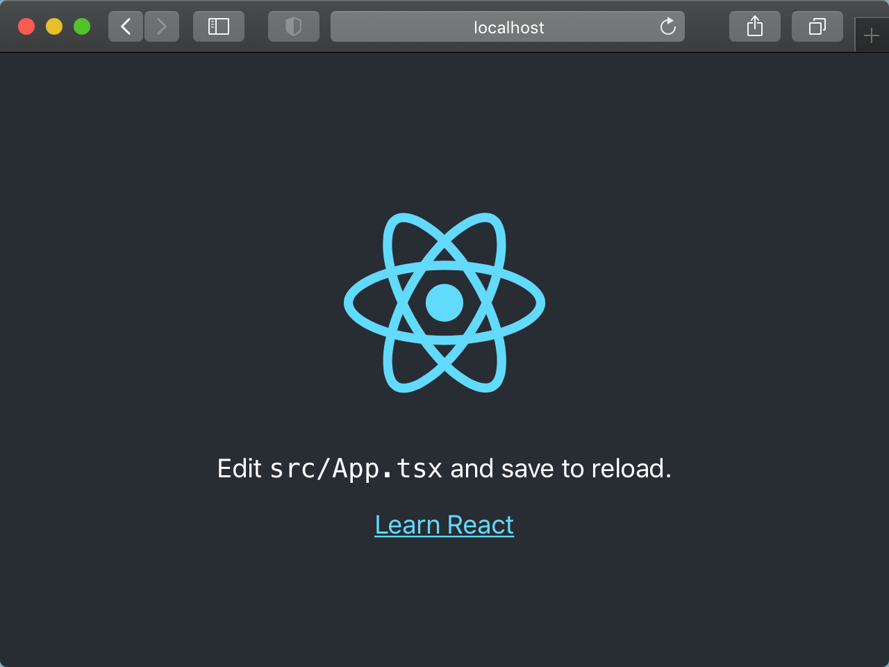
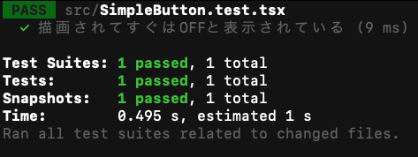
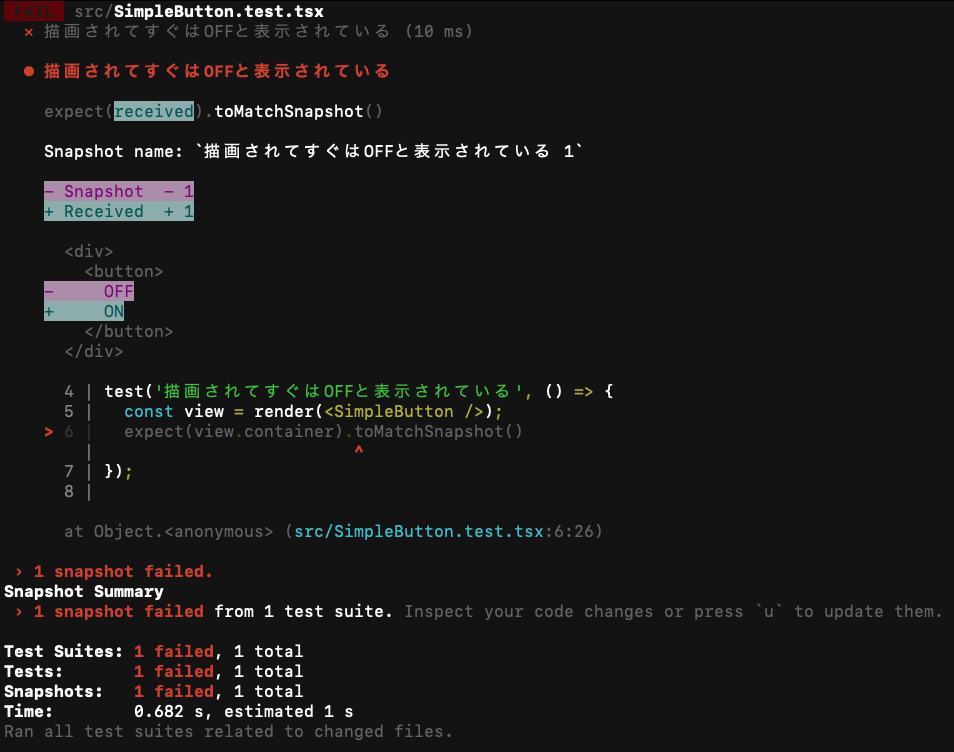

# Reactコンポーネントのテストを書こう

このチュートリアルでは、Reactコンポーネントのテストを書くことを学びます。

## 本章で学べること

本章では、簡単なコンポーネントのテストを書くことを目標に、具体的には次のことをやっていきます。

- UIテストのためのライブラリ群`testing-library`を使ったテストの作成
- `Jest`を使ったスナップショットテストの作成

本章の目的はコンポーネントのテストを完全に理解することではありません。むしろ、それがどういったものなのか、その雰囲気を実際に体験することに主眼を置いています。
そのため、内容はかなり最低限のものとなりますが、逆に言えば少しの時間でコンポーネントテストを試してみれるシンプルな内容にまとまってますから、ぜひ手を動かしてみてください。

:::info
Reactでコンポーネントが作れることを前提にしますので、Reactの基本的な使い方を知りたいという方は[Reactでいいねボタンを作ろう](./react-like-button-tutorial.md)をご参照ください。
:::

## Reactプロジェクトの作成

テストに使用するためのReactプロジェクトを作成します。下記コマンドを実行してください。

```shell
npx create-react-app component-test-tutorial --template typescript
```

上記を実行すると次のように聞かれることがありますが、`y`を押して`create-react-app`をインストールしてください。時間がかかることもあるので、のんびり待ちましょう。

```shell
Need to install the following packages:
  create-react-app
Ok to proceed? (y)
```

成功すると今いるディレクトリ配下に`component-test-tutorial`というディレクトリが作られます。
そのまま下記コマンドを実行して`component-test-tutorial`に移動しましょう。

```shell
cd component-test-tutorial
```

`component-test-tutorial`配下のファイル構成は次のようになっているはずです。

```text
├── README.md
├── node_modules
├── package-lock.json
├── package.json
├── public
├── src
└── tsconfig.json
```

ここで次のコマンドを実行してください。

```shell
yarn start
```

自動的にブラウザが開かれて次の画像のように表示されれば、プロジェクト作成が成功しています。



## テストするコンポーネント

ここでは、簡単なボタンコンポーネントのテストを書くことを例に進めていきます。
具体的には、はじめは`OFF`となっているボタン上の文字が、ボタンをクリックするたびに`ON`/`OFF`と切り替わるようなボタンを題材にします。


このコンポーネントについて、ボタンをクリックすると`ON`/`OFF`の表示が切り替わることをテストしましょう。

## テスト対象のコンポーネントを作る

テストを作成するために、まずはテスト対象となるコンポーネントを実装していきます。
`src`ディレクトリ配下に、`SimpleButton.tsx`という名前でファイルを作成してください。

```shell
cd src
touch SimpleButton.tsx
```

このファイルを作ると、`src`ディレクトリのファイル構成は次のようになります。

```text
├── App.css
├── App.test.tsx
├── App.tsx
├── index.css
├── index.tsx
├── logo.svg
├── react-app-env.d.ts
├── reportWebVitals.ts
├── setupTests.ts
└── SimpleButton.tsx
```

`SimpleButton.tsx`の内容は次のようにします。

```tsx twoslash title="SimpleButton.tsx"
// @noErrors
import { useState } from "react";

export const SimpleButton: () => JSX.Element = () => {
  const [state, setState] = useState(false);
  const handleClick = () => {
    setState((prevState) => !prevState);
  };
  return <button onClick={handleClick}>{state ? "ON" : "OFF"}</button>;
};
```

ここで、この`SimpleButton`コンポーネントの挙動を確認してみましょう。
`index.tsx`ファイルを次のようにして保存してください。

```tsx twoslash title="index.tsx"
// @noErrors
import React from "react";
import ReactDOM from "react-dom/client";
import { SimpleButton } from "./SimpleButton";

const root = ReactDOM.createRoot(
  document.getElementById("root") as HTMLElement
);
root.render(
  <React.StrictMode>
    <SimpleButton />
  </React.StrictMode>
);
```

そのうえで下記コマンドを実行しましょう。

```shell
yarn start
```

すると、ブラウザが自動で立ち上がり、次のようなボタンが表示されます。
初めは`OFF`と表示され、クリックにより`ON`と`OFF`が交互に切り替わることを確認してください。


:::info
ボタンが小さければ、ブラウザの拡大率を上げてみると大きく表示されます。
:::

これで今回テストするコンポーネントを作成できました。

## `testing-library`を使ったテストの作り方とやり方

ここからはテストの作り方とやり方に入ります。
今回は、ボタンをクリックすると`ON`/`OFF`の表示が切り替わることをテストしていきます。

Reactコンポーネントをテストする方法は複数ありますが、ここでは利用者が比較的多い`testing-library`というライブラリ群を用いる方法を紹介します。
`testing-library`はUIコンポーネントのテストをするためのライブラリ群であり、コンポーネントの描画やコンポーネントに対する操作などが実現できます。`testing-library`があれば、コンポーネントのテストはひととおりできると考えてよいでしょう。

それでは、実際に`testing-library`を使ってテストを作っていきましょう。
まずは先ほどと同じ`src`ディレクトリ配下で`SimpleButton.test.tsx`というファイルを作成します。

```shell
touch SimpleButton.test.tsx
```

このファイルに、テストを実行するためのひな形を書きます。

```tsx twoslash title="SimpleButton.test.tsx"
// @noErrors
test("ボタンをクリックするとON/OFFの表示が切り替わる", () => {
  // ここにテストの中身を書いていきます
});
```

ここにテストの中身を追加していきます。今回はボタンをクリックすると`ON`/`OFF`の表示が切り替わることがテストしたいので、次のような流れのテストコードになります。

1. ボタンを描画する
2. `OFF`と表示されていることを確かめる
3. ボタンをクリックする
4. `ON`と表示されていることを確かめる

:::info
コンポーネントのテストは、コンポーネントを描画した後、次の2つのことを組み合わせて実現されます。

1. コンポーネントに操作を施す
2. コンポーネントの状態を確かめる

今回の例もボタンを描画した後、「`OFF`と表示されている」という状態確認から始まり、「クリック」という操作を施した後、再び「`ON`と表示されている」という状態確認をします。
みなさんが自分でコンポーネントのテストを書く際も、どのような操作と状態確認を行えばよいかを意識することでテスト作成がスムーズにできるはずです。
:::

まずはボタンを描画してみましょう。
コンポーネントの描画は`@testing-library/react`の`render()`を使って、次のようにするだけです。なお、この`@testing-library/react`というライブラリは、今回`create-react-app`でReactアプリケーションを作成したためすでにプロジェクトにインストールされています。

```tsx twoslash title="SimpleButton.test.tsx"
// @noErrors
import { render } from "@testing-library/react";
import { SimpleButton } from "./SimpleButton";

test("ボタンをクリックするとON/OFFの表示が切り替わる", () => {
  render(<SimpleButton />);
});
```

ボタンが描画されたので、次は`OFF`と表示されていることを確かめます。具体的には、ボタンのDOM(DOMとは、ここではボタンを表すオブジェクトくらいに捉えていただければ大丈夫です)を取得し、そのテキストが`OFF`という文字列に等しいかのアサーションを実施します。
今回、ボタンのDOMの取得には`@testing-library/react`が提供するクエリのひとつである`getByRole()`を使います。これは[WAI-ARIA](https://developer.mozilla.org/ja/docs/Learn/Accessibility/WAI-ARIA_basics)(アクセシビリティ向上を主目的として定められたwebの仕様)で定められたRoleを引数に指定すると、そのRoleを持つコンポーネントを取得するクエリです。詳細は[公式ドキュメント](https://testing-library.com/docs/queries/byrole)をご参照ください。

具体的には、このように書けます。

```tsx twoslash title="SimpleButton.test.tsx"
// @noErrors
import { render, screen } from "@testing-library/react";
import { SimpleButton } from "./SimpleButton";

test("ボタンをクリックするとON/OFFの表示が切り替わる", () => {
  render(<SimpleButton />);
  const simpleButton = screen.getByRole("button");
});
```

そして、ボタンのテキストのアサーションは`@testing-library/jest-dom`が提供する`toHaveTextContent()`を使います。
`expect()`にコンポーネントを渡し、そのまま`toHaveTextContent()`を呼び出すと、そのコンポーネントがどのようなテキストを持っているかのアサーションが行なえます。
具体的には次のようになります。

```tsx twoslash title="SimpleButton.test.tsx"
// @noErrors
import { render, screen } from "@testing-library/react";
import { SimpleButton } from "./SimpleButton";

test("ボタンをクリックするとON/OFFの表示が切り替わる", () => {
  render(<SimpleButton />);
  const simpleButton = screen.getByRole("button");
  expect(simpleButton).toHaveTextContent("OFF");
});
```

ここで一旦`yarn test`コマンドでテストを実行し、テストが通ることを確認しましょう。次のような結果になるはずです。


さて、次にボタンをクリックします。
コンポーネントの操作は`testing-library`に収録されている`@testing-library/user-event`を使って実現できます。`@testing-library/user-event`はコンポーネントの操作を含む、色々なユーザーイベントをテストで実行するライブラリです。
具体的には`click()`にクエリでみつけた`simpleButton`を引数として渡すことで、ボタンのクリックを実現できます。

```tsx twoslash title="SimpleButton.test.tsx"
// @noErrors
import { render, screen } from "@testing-library/react";
import userEvent from "@testing-library/user-event";
import { SimpleButton } from "./SimpleButton";

test("ボタンをクリックするとON/OFFの表示が切り替わる", () => {
  render(<SimpleButton />);
  const simpleButton = screen.getByRole("button");
  expect(simpleButton).toHaveTextContent("OFF");
  userEvent.click(simpleButton);
});
```

続けて、ボタンがクリックされた後のアサーションを実施します。
先ほどと同様に`toHaveTextContent()`を用いますが、今度はボタンのテキストが`ON`になっていることを確認しましょう。

```tsx twoslash title="SimpleButton.test.tsx"
// @noErrors
import { render, screen } from "@testing-library/react";
import userEvent from "@testing-library/user-event";
import { SimpleButton } from "./SimpleButton";

test("ボタンをクリックするとON/OFFの表示が切り替わる", () => {
  render(<SimpleButton />);
  const simpleButton = screen.getByRole("button");
  expect(simpleButton).toHaveTextContent("OFF");
  userEvent.click(simpleButton);
  expect(simpleButton).toHaveTextContent("ON");
});
```

この状態で`yarn test`コマンドでテストを実行し、テストが通ることを確認しましょう。次のような結果になるはずです。


以上が、`testing-library`を用いてコンポーネントのテストを作成する流れです。
`testing-library`からは、ここで紹介したもの以外にも多くのクエリやアサーション、ユーザーイベントの機能が提供されています。
英語にはなってしまいますが、クエリは[こちら](https://testing-library.com/docs/queries/about)、アサーションは[こちら](https://github.com/testing-library/jest-dom#custom-matchers)、ユーザーイベントは[こちら](https://testing-library.com/docs/user-event/intro)に公式ドキュメントによる詳細な説明があります。実際に自分でテストを作る際には、ぜひそれらも確認してみてください。

## `Jest`を使ったスナップショットテストの作り方とやり方

ここからは「スナップショットテスト」と呼ばれるテスト手法について解説します。

先ほどまでのテストはコンポーネントのある部分(例: テキスト)の状態を確認するものでしたが、「スナップショットテスト」はコンポーネントの全体の状態を確かめるためのテストです。
より正確には、コンポーネントのDOMをまるごと保存し、その保存したDOMと、テスト実行時にコンポーネントを描画して生成したDOMとが一致するかを確認します(DOMとは何かがよく分からない場合、ここではひとまず「コンポーネントを表すオブジェクト」程度に捉えてください)。

「スナップショットテスト」は簡単に書くことができます。それでいてスタイルなど含めた全体の確認ができるので、手軽なリグレッションテストとして活用できます。一方で、そうであるからこそコンポーネントを一旦作り終えるまでは機能しないテストですので、テストファーストの開発には不向きです。

:::caution
本来、スナップショットテストの対象はコンポーネントおよびDOMに限られたものではありません。幅広い対象にスナップショットテストが実施できます。詳しくはJestの[公式ドキュメント](https://jestjs.io/ja/docs/snapshot-testing#%E3%82%B9%E3%83%8A%E3%83%83%E3%83%97%E3%82%B7%E3%83%A7%E3%83%83%E3%83%88%E3%83%86%E3%82%B9%E3%83%88%E3%81%AFreact%E3%82%B3%E3%83%B3%E3%83%9D%E3%83%BC%E3%83%8D%E3%83%B3%E3%83%88%E3%81%A7%E3%81%AE%E3%81%BF%E5%88%A9%E7%94%A8%E3%81%A7%E3%81%8D%E3%81%BE%E3%81%99%E3%81%8B)をご参照ください。
:::

それでは、スナップショットテストを実際にやってみましょう。
先ほどと同じ`src`ディレクトリ配下で`SimpleButton.test.tsx`というファイルを作成します。

```shell
touch SimpleButton.test.tsx
```

:::info
「`testing-library`を使ったテストの作り方とやり方」から続けてこのチュートリアルを実施される方は、ここから作成するテストケースを`SimpleButton.test.tsx`内に追加で書いていくのでも大丈夫です。
:::

スナップショットテストは次の2ステップから成ります。

1. スナップショットを検証したい状態にコンポーネントを持っていく
2. スナップショットに照合する

ここではボタンが描画されてまだ何も操作されていない状態、つまりボタンにOFFと表示されている状態についてスナップショットテストを実施することを考えます。描画されたばかりの状態を検証したいので、描画してすぐにスナップショット照合を行えばよいことになります。

この考えをもとに、実際のコードを書いてみましょう。
コンポーネントの描画には`@testing-library/react`の`render`関数を、スナップショットの照合にはJestの`toMatchSnapshot()`関数をそれぞれ使用して次のように書くことができます。

```tsx twoslash title="SimpleButton.test.tsx"
// @noErrors
import { render } from "@testing-library/react";
import { SimpleButton } from "./SimpleButton";

test("描画されてすぐはOFFと表示されている", () => {
  const view = render(<SimpleButton />);
  expect(view.container).toMatchSnapshot();
});
```

:::info
Jest単体ではReactコンポーネントの描画ができません。そこで、コンポーネントの描画をするためのライブラリを使用する必要があります。多くのライブラリがありますが、ここでは前章「`testing-library`を使ったテストの作り方とやり方」でも紹介した`@testing-library/react`を用いました。
:::

テストファイルが作成できたら、`yarn test`コマンドを実行します。

```shell
yarn test
```

そうすると次のように表示され、テストが実行されて成功した(`PASS`した)ことがわかります。



さて、このとき`src`ディレクトリの中に`__snapshots__`というディレクトリが自動で追加されているはずです。これはJestがスナップショットテスト用のファイルを保存していくためのフォルダです。
Jestのスナップショットテストは初回実行時にスナップショットテスト用のファイルを生成し、2回目から照合を行います。いまは初回実行だったため、ファイルとその置き場であるディレクトリが自動で生成されました。

ここでスナップショットテストについてもう少しだけ知るために、生成されたスナップショットテスト用のファイルの中身を覗いてみましょう。

`__snapshots__`ディレクトリの中に作られた`SimpleButton.test.tsx.snap`は次のようになっています。

```txt twoslash title='SimpleButton.test.tsx.snap'
// Jest Snapshot v1, https://goo.gl/fbAQLP
exports[`描画されてすぐはOFFと表示されている 1`] = `
<div>
  <button>
    OFF
  </button>
</div>
`;
```

このように、スナップショットテスト用のファイルはテストケースの名前と、そのテストケースで使われるスナップショットで構成されています。

さて、今回生成されたスナップショットは`OFF`というテキストを持った`button`タグと、その親要素である`div`タグで構成されています。
これは、まさに先ほど作った`SimpleButton`コンポーネントのDOMに一致します(`div`要素はReactの起動時に自動生成される要素です)。
このスナップショットテストは実行のたびに、`SimpleButton`コンポーネントを描画して、たった今作られたこのスナップショットとの違いが生まれていないかを確認してくれます。
たとえば、もしも何かの手違いで`SimpleButton`コンポーネントが描画されたときに`ON`と表示されるようになっていたら、このスナップショットテストに引っかかるのです。

ここで、実際に失敗する様子も確認してみましょう。`SimpleButton`コンポーネントが描画されたときに`ON`と表示されるよう変更を加えます。

```tsx twoslash {4,5} title="SimpleButton.tsx"
import { useState } from "react";

export const SimpleButton: () => JSX.Element = () => {
  const [state, setState] = useState(true);
  // falseからtrueに変更               ^^^^
  const handleClick = () => {
    setState((prevState) => !prevState);
  };
  return <button onClick={handleClick}>{state ? "ON" : "OFF"}</button>;
};
```

この状態で`yarn start`コマンドを実行すると、描画されたボタンの文字の初期値が`ON`になっていることが分かります。

さて、ここで`yarn test`コマンドを実行します。

```shell
yarn test
```

先ほどのスナップショットテストが実行されますが、今回はテストが通らず、描画されたコンポーネントとスナップショットの差分が表示されます。



今回はボタン内テキストの初期値を変更しましたが、たとえば`button`タグから`div`タグへの変更や`button`タグへのクラスの追加など、DOMに対する変更のほとんどをスナップショットテストで検知できます。

スナップショットテストの詳しいやり方やベストプラクティスなど、さらに詳しい情報に触れたい方はJestの[公式ドキュメント](https://jestjs.io/ja/docs/snapshot-testing)をご参照ください。

以上でJestを使ったスナップショットテストのチュートリアルは完了です。
